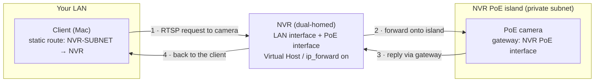

# HikViewer

Native macOS live viewer for Hikvision IP cameras, with NVR playback. One
window, a grid of hardware-decoded tiles — no browser, no HLS, sub-second
latency.

Per camera, `ffmpeg` stream-copies the RTSP feed to a raw HEVC/H.264 elementary
stream (no transcode), and the app (`Sources/*.swift`) parses it into
`CMSampleBuffer`s fed to `AVSampleBufferDisplayLayer` for hardware decode. Dead
or stalled streams reconnect automatically.

## Install (from a release)

One Terminal command — downloads the latest tagged release, verifies its
SHA-256, and installs a quarantine-free `HikViewer.app` into `/Applications`
(the app is ad-hoc signed; browser downloads would trip Gatekeeper):

```sh
/bin/bash -c "$(curl -fsSL https://github.com/alkait/HikViewer/releases/latest/download/install.sh)"
```

Installed apps update themselves: **HikViewer → Check for Updates…** (also
checked automatically at launch) re-runs the same installer.

Releases are built by CI (`.github/workflows/release.yml`): a plain push to
`main` only runs a compile check; pushing a `vX.Y.Z` tag publishes the
release that the updater and the command above track. `./push.sh
[patch|minor|major]` does the push + tag in one step.

## Build & run

```sh
./build.sh            # universal (Apple Silicon + Intel): ./hikviewer + HikViewer.app
./build.sh --install  # ...and copy HikViewer.app into /Applications
./build.sh --native   # quick single-arch bare binary for this Mac only (dev)
```

To install manually instead, drag `HikViewer.app` into `/Applications`
(or `cp -R HikViewer.app /Applications/`).

`./build.sh` produces **`HikViewer.app`** — double-clickable, with the app icon in
Finder / Launchpad / Dock — plus the bare **`./hikviewer`** binary. Open either:

```sh
open HikViewer.app    # or double-click it in Finder
./hikviewer           # run the binary directly
```

Needs `ffmpeg` on `PATH` (`brew install ffmpeg`). If it's missing the app shows a
dialog with the install command and quits. On first launch it opens the Settings
window (`Cmd-,`) to add cameras.

**Keys:** double-click a tile to focus it full-window — a focused tile switches
from the substream to that camera's main stream; `Esc` returns to the grid;
`Cmd-Q` quits. In the grid, **arrow keys** show a red cursor on the first (or
last-used) tile and move it around; **Return** focuses that camera, and the
cursor fades away after 5 s of inactivity. Long-press (hold) a tile to lift it
and drag it to a new spot in the grid — the other tiles shift out of the way,
`Esc` cancels the drag, and the order is saved. On a focused tile, `P` opens
recorded-footage playback (see below).

**Digital zoom (focused view, live or playback):** pinch to zoom toward the
pointer (1×–8×), double-click for a quick 2× at that spot (double-click again
to restore). When zoomed, two-finger scroll or click-drag pans (the frame edge
never enters the view), a `2.4× ✕` badge in the top-right shows the level
(click it to reset), and `Esc` zooms back out first before leaving
playback/full view. Zoom survives switching between live and playback on the
same camera and resets when you return to the grid.

**Supplementary cameras (focused view):** press **`+`** for a selector panel —
a thumbnail grid of the other cameras; just start typing to filter (`Esc`
clears the filter, then closes), `Return` picks the top match, click outside
closes. Up to **4 floating panes**: drag to move, drag the bottom-right corner
to resize, `✕` to close. Panes show live video while the main view is live
(tapping the already-running grid substreams — zero extra sessions), and
playback **synced to the main view's position and speed** while it's in
playback (re-aligned on every seek/pause/speed change; cameras not recorded on
the NVR show "no recording"). **Double-click a pane** to open that camera as a
plain standard view at the same moment — no panes there, adding disabled — and
a translucent **back arrow** (top-left, shown only when `Esc` would leave that
view) or `Esc` returns to the original camera with its panes restored. Pane
layouts persist per main camera (`layouts.json` in Application Support); when
no panes are up, the selector offers **"↺ Restore last"** to bring back the
previous set exactly where it was.

## Config

Everything is in the Settings window (`Cmd-,`): the camera list (add / edit /
remove; double-click a row, or select and "Edit…", to open the per-camera sheet).
Each camera carries its own **name, host/IP, username, password, RTSP port, and
codec** (HEVC or H.264) — so a mixed fleet with different credentials works (e.g.
a door station on H.264 alongside HEVC cameras). Saving applies immediately.

The grid pulls each camera's substream (RTSP `…/Streaming/Channels/102`); a
focused tile pulls the main stream (`…/101`).

The Settings window also has an **NVR** row (host, user, password) — optional,
used only for playback.

Config (cameras + passwords) is a single JSON file at
`~/Library/Application Support/hikviewer/config.json`, chmod `600`.
**File → Export / Import Cameras…** writes and reads that same JSON, so moving a
setup between Macs is one file.

> **Not the Keychain, by design.** A self-built binary is rebuilt often, and each
> rebuild changes its code identity — the Keychain would then re-prompt for every
> item after every build. The 0600 file avoids that. Trade-off: passwords sit in a
> file your account can read, and an exported file contains them in clear — treat
> it as a secret.

## Playback (recorded footage from the NVR)

Live viewing is direct-to-camera; recordings live on the NVR, so playback goes
through it. Configure the NVR (host + credentials) in Settings, then on a
**focused** tile press **`P`**:

- A bar appears at the bottom: a **play/pause button**, the date (click it for
  a **calendar** — days with recordings show as teal chips; everything else is
  dimmed and unclickable), a 24-hour timeline — AM/PM hour labels, recorded
  ranges in teal, a red "now" marker — a loading spinner while a seek spins
  up, the playback clock, a **zoom button**, and a **speed button**
  (1× → 2× → 4×). **Click the timeline to jump anywhere**; the substream keeps
  running underneath, so `Esc` back to live is instant.
- **Zoom:** the timeline always opens on the full day; the zoom button cycles
  presets (24h → 6h → 1h → 10m), or scroll/pinch on the strip to zoom around
  the mouse. Two-finger horizontal scroll pans a zoomed window, the window
  follows the cursor while playing, and changing days resets to 24h. Tick and
  label density adapt to the zoom (24h: labels every 3 h; 6h: hourly; 1h:
  every 10 min; 10m: every 2 min).
- **Space** (or the button) pauses/resumes. **←/→** seek ±10 s, **Shift-←/→**
  ±60 s, **Cmd-←/→** ±15 min, and **0–9** jumps to that tenth of the recorded
  footage currently *in view* (YouTube style — zoomed in, it works within the
  visible slice). `N` / `Shift-N` jump to the next / previous motion block
  (within the day — never rolling into another day), `C` opens the calendar,
  `P` or `Esc` returns to live.
- When playback reaches the end of the recorded video (the live edge or a gap
  with nothing after it), it pauses.
- **Motion highlights:** red blocks on the timeline mark motion (the thin red line is the "now" marker). The 🚶 and
  🚗 toggles mirror the NVR's Human/Vehicle checkboxes (both ON by default): with neither on, all
  motion is shown (from the NVR's alarm log — one fetch covers every camera
  and is cached per day); with either on, only AcuSense-classified human
  and/or vehicle motion is shown — each camera remembers its filter choice — (via `/ISAPI/ContentMgmt/SearchByTargetType`,
  the same API the NVR's own web player uses — found by reading its JS, since
  it's absent from the ISAPI docs). Note that unlike every XML endpoint, that
  JSON API speaks *real* ISO 8601 with UTC offsets, not local-time-with-fake-Z.
- Playback does **not** go through ffmpeg: its RTP layer sits on the NVR's
  initial burst for ~4 s before emitting anything (the NVR itself answers in
  ~0.25 s). `PlaybackStream.swift` speaks RTSP/RTP directly — digest auth,
  TCP-interleaved, HEVC + H.264 depacketization into the same parser the live
  tiles use — so a seek is on screen in ~0.3 s, and fast playback is just the
  RTSP `Scale` header on PLAY.

No per-camera setup: the app asks the NVR which channel each camera IP is
plugged into (`/ISAPI/ContentMgmt/InputProxy/channels`) and matches it to the
camera list. A camera the NVR doesn't record shows "not recorded on this NVR".

Two Hikvision quirks the implementation works around, for future reference:
recorded-segment search (`/ISAPI/ContentMgmt/search`) reports `codecType`
wrongly (H.264 for HEVC channels — the per-camera codec from Settings is used
instead), and all ISAPI/RTSP-playback timestamps end in `Z` but are actually
the **NVR's local time**, so the app reads the NVR's UTC offset from
`/ISAPI/System/time` and formats every time in that zone.

## Cameras behind an NVR's built-in PoE ports

Cameras plugged into a normal switch on your LAN work as soon as you add them.
Cameras plugged into an NVR's **built-in PoE ports** are a special case: the NVR
puts them on a private, isolated subnet (commonly `192.168.254.0/24` or a
`10.x.x.x` range) that the rest of your LAN can't reach. RTSP relayed through the
NVR is often re-encrypted (Hik-Connect "stream encryption"), so the reliable path
is to reach each camera's **own** RTSP directly. Three pieces make that work,
without moving any cables:

1. **NVR side — routing.** Enable the NVR's **Virtual Host** feature. On Hikvision
   NVRs this also switches on the kernel's `ip_forward` between the NVR's LAN
   interface and its internal PoE interface — i.e. the NVR becomes a router
   between the two networks.
2. **Camera side — a return path.** Set each PoE camera's **default gateway** to
   the NVR's internal PoE interface address (often `…254.1`). Without a gateway
   the camera can't reply to a client on your LAN, so RTSP (port 554) never
   completes even though HTTP might. Keep the NVR channel in **Manual** add-mode
   (not Plug-and-Play) so the NVR doesn't overwrite this. Applying it usually
   needs a camera reboot; recording continues on the other channels.
3. **Client side — a static route.** Tell your Mac (or your router, to cover the
   whole LAN) to send the isolated subnet to the NVR. On macOS, persisted across
   reboots:

   ```sh
   sudo networksetup -setadditionalroutes Wi-Fi <NVR-SUBNET> <MASK> <NVR-LAN-IP>
   # e.g.  … Wi-Fi 192.168.254.0 255.255.255.0 <NVR-LAN-IP>
   # verify:  networksetup -getadditionalroutes Wi-Fi
   ```

Then add each camera to Settings by its private (`…254.x`) address like any other.

The route and the gateway are one matched pair — the route carries the request
in, the camera gateway carries the reply back out, with the NVR routing between
the two networks:



> **Security note.** Giving isolated cameras a gateway also gives them a path off
> their subnet they didn't have before. If you want to keep them off the internet,
> block the private subnet → WAN at your router, and keep the client-side route on
> just the machines that need it.

## Fast start

The grid paints in three stages so it's never blank:

1. **Instant (0 ms).** Each tile shows its last-known frame from an on-disk cache
   (`~/Library/Application Support/hikviewer/cache/<host>.jpg`), dimmed and badged
   **cached** since it may be stale.
2. **~300 ms.** A live JPEG snapshot (ISAPI `/picture`) replaces it and refreshes
   the cache; the badge clears.
3. **~0.5–1.5 s.** Live video takes over. ffmpeg skips input analysis for HEVC
   (codec params come from the RTSP SDP), and the viewer requests an immediate
   keyframe (`requestKeyFrame`, a runtime request — no config change) instead of
   waiting out the GOP.

A camera that's slow or offline keeps showing its **cached** frame (clearly
badged) rather than a black tile.

## Notes

- HEVC and H.264, hardware-decoded via VideoToolbox; set each camera's codec in
  Settings. Tiles show the active stream's resolution once live.
- H.264 skips the zero-probe fast-start (the raw H.264 muxer needs the SPS
  dimensions before it can write), so an H.264 tile may take ~1 s longer to appear
  than an HEVC one.
- The binary is ad-hoc signed, not notarized. A copy that arrives via
  download/AirDrop gets Gatekeeper quarantine — right-click → Open once, or
  `xattr -dr com.apple.quarantine HikViewer.app`. It also needs `ffmpeg` installed
  on that Mac (and the static route above, if any cameras are NVR-isolated).

## Requirements

macOS 12+, `ffmpeg`, and Xcode Command Line Tools to build (`swiftc`).
