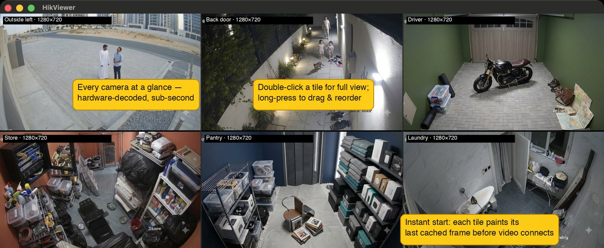
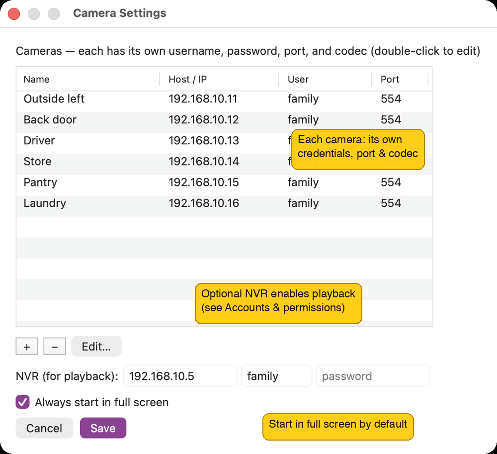
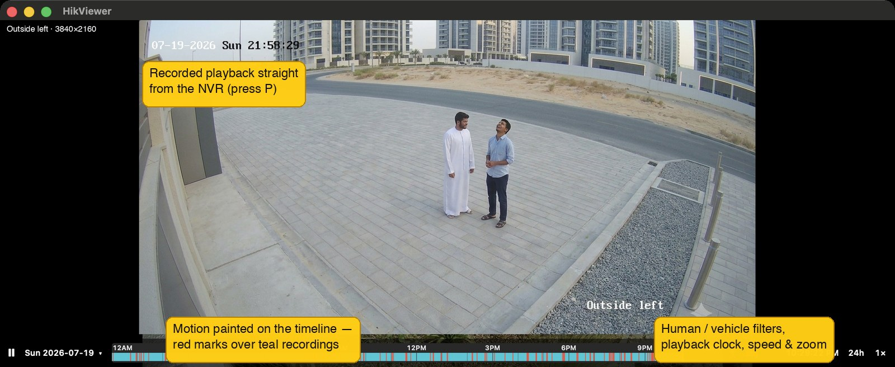
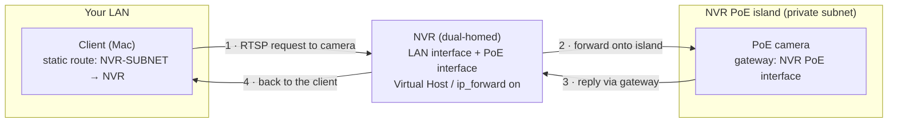

# HikViewer

Native macOS live viewer for Hikvision IP cameras, with NVR playback. One
window, a grid of hardware-decoded tiles — no browser, no HLS, sub-second
latency.

- **Live grid** of all your cameras (substreams), any of them one double-click
  away from a full-window main-stream view with digital zoom.
- **Recorded playback** straight from your NVR: calendar, 24-hour timeline,
  motion highlights with Human/Vehicle filtering, up to 4× speed.
- **Floating supplementary panes** to watch several cameras side by side —
  live, or synced to the same playback moment.
- Starts fast (cached frames paint instantly), reconnects dead streams
  automatically, and keeps everything in one small self-contained app.



*Screenshots show AI-generated demo footage — not a real home.*

## Download

One Terminal command installs (and later updates) the app — it fetches the
latest release, verifies its SHA-256, and installs a quarantine-free
`HikViewer.app` into `/Applications`:

```sh
/bin/bash -c "$(curl -fsSL https://github.com/alkait/HikViewer/releases/latest/download/install.sh)"
```

Prefer a manual download? Grab
[**HikViewer-macos-universal.app.zip**](https://github.com/alkait/HikViewer/releases/latest/download/HikViewer-macos-universal.app.zip)
(latest release), unzip, drag `HikViewer.app` into `/Applications`, then
right-click → Open the first time (the app is ad-hoc signed, so a browser
download trips Gatekeeper — the install script above avoids that).

## Quick start

1. **Install ffmpeg** (the only dependency): `brew install ffmpeg`
2. **Install HikViewer** with the one-line command in
   [Download](#download) above.
3. **Add cameras.** On first launch the Settings window opens (`Cmd-,`); add
   each camera's name, host/IP, username, password, RTSP port, and codec
   (HEVC or H.264). Mixed fleets with different credentials are fine. Saving
   applies immediately.
4. Optionally fill the **NVR** row (host, user, password) to enable recorded
   playback — see [Accounts & permissions](#accounts--permissions) for the
   account to use.



Installed apps update themselves: **HikViewer → Check for Updates…** (also
checked automatically at launch).

Requires macOS 12 or later (Apple Silicon or Intel).

## Tested hardware

Developed and tested against this setup — close relatives will very likely
work, but these are the known-good models:

| Device | Model | Firmware |
|---|---|---|
| NVR | Hikvision DS-7732NI-M4/16P (M-series, "NVR 5.0" GUI) | V5.04.081 |
| Bullet cameras | DS-2CD2083G2-LI2U, DS-2CD2063G2-LI2U, DS-2CD2047G2H-LIU | V5.7.5 – V5.7.18 |
| Turret/dome cameras | DS-2CD2163G2-LIS2U, DS-2CD2347G2H-LIU | V5.7.14 – V5.7.19 |
| Door station | DS-KD8003-IME1(B) | V2.2.75 |

## Accounts & permissions

Don't put your `admin` passwords in a viewer app if you don't have to.
HikViewer only *watches*, so it runs happily on least-privilege accounts —
with a few Hikvision-specific gotchas found the hard way:

**Cameras.** Create a **Viewer**-level user on each camera and use that in
HikViewer. Two quirks:

- A freshly created Viewer has **every permission switched off** — you must
  explicitly enable *Remote: Live View* and *Remote: Playback* for the new
  user, or tiles stay black.
- Door stations (video intercoms) generally can't have extra users at all;
  for those, the admin account is the only option.

**NVR.** Create a non-admin user (Operator template is a good base) and grant
it these **remote** permissions:

| Permission | Why HikViewer needs it |
|---|---|
| Live View (`preview`) | camera snapshots via the NVR |
| Playback (`playBack`) | recorded footage |
| Log Search (`logOrStateCheck`) | generic motion highlights (alarm log) |
| **Parameter Config** (`parameterConfig`) | **Human/Vehicle motion highlights** |

That last row is the surprising one: on the tested firmware, the AcuSense
smart-search API (`/ISAPI/ContentMgmt/SearchByTargetType`) — which powers the
🚶/🚗 motion filters, and which the NVR's own web player uses — is gated
behind *Parameter Config*, not behind any read permission. Without it the NVR
answers `403 lowPrivilege` and the motion bar stays empty whenever a
Human/Vehicle filter is on (the filters are on by default). With both filters
toggled off, motion still works through the alarm log — but that path is much
slower (~10–15 s per day, since the NVR ignores the log filter and the app
must page through the entire day's log).

Trade-off to know: *Parameter Config* lets the account change NVR settings
remotely. It still can't manage users, add/remove cameras, reboot, or upgrade
firmware. If you'd rather not grant it, leave both motion filters off and
accept the slower alarm-log motion.

## Everyday use

### The grid

| Action | Effect |
|---|---|
| Double-click a tile | focus it full-window (switches to the camera's main stream) |
| `Esc` | back to the grid |
| Arrow keys | move a red selection cursor between tiles (fades after 5 s) |
| `Return` | focus the selected tile |
| Long-press + drag a tile | reorder the grid (order is saved); `Esc` cancels |
| `Cmd-,` | Settings |
| `Cmd-Q` | quit |

The app can start in full screen — controlled by the "Always start in full
screen" checkbox in Settings (on by default).

### Digital zoom (focused view, live or playback)

Pinch to zoom toward the pointer (1×–8×), or double-click for a quick 2× at
that spot (double-click again to restore). When zoomed: two-finger scroll or
click-drag pans, a `2.4× ✕` badge (top-right) shows the level — click it to
reset — and `Esc` zooms out first before leaving the view. Zoom survives
switching between live and playback on the same camera.

### Supplementary panes (focused view)

Press **`+`** for a selector panel — a thumbnail grid of the other cameras;
type to filter, `Return` picks the top match, `Esc`/click-outside closes. Up
to **4 floating panes**: drag to move, resize from any edge or corner, `✕` to
close. Panes show live video while the main view is live (tapping the
already-running grid substreams — zero extra sessions), and playback **synced
to the main view's position and speed** while it's in playback. Double-click
a pane to open that camera as the main view at the same moment; the back
arrow (or `Esc`) returns to the original camera with its panes restored. Pane
layouts persist per main camera, and the selector offers **"↺ Restore last"**
to bring back the previous set.

### Playback (recorded footage from the NVR)

On a **focused** tile press **`P`**. A bar appears at the bottom: play/pause,
the date (click for a **calendar** — days with recordings are teal), a
24-hour timeline with recorded ranges in teal and motion in red, a zoom
button, and a speed button (1× → 2× → 4×). Click the timeline to jump
anywhere; the live substream keeps running underneath, so `Esc` back to live
is instant.



| Key | Effect |
|---|---|
| `Space` | pause / resume |
| `←` / `→` | seek ±10 s (`Shift`: ±60 s, `Cmd`: ±15 min) |
| `0`–`9` | jump to that tenth of the footage in view (YouTube style) |
| `N` / `Shift-N` | next / previous motion block |
| `C` | calendar |
| `P` or `Esc` | back to live |

- **Timeline zoom:** the zoom button cycles 24h → 6h → 1h → 10m, or
  scroll/pinch on the strip; two-finger scroll pans, and the window follows
  the playhead while playing.
- **Motion highlights:** red blocks mark motion. The 🚶 and 🚗 toggles mirror
  the NVR's Human/Vehicle checkboxes (both **on** by default → AcuSense
  smart search; needs the NVR permission described above). With both off, all
  motion is shown from the NVR's alarm log — slower to load, cached per day.
  Each camera remembers its filter choice.
- Playback pauses when it reaches the live edge or a gap with nothing after
  it. No per-camera setup is needed: the app asks the NVR which channel each
  camera is plugged into and matches it to your camera list; a camera the NVR
  doesn't record shows "not recorded on this NVR".

## Config file

Everything (cameras + NVR + passwords) lives in a single JSON file at
`~/Library/Application Support/hikviewer/config.json`, chmod `600`.
**File → Export / Import Cameras…** writes and reads that same JSON, so moving
a setup between Macs is one file.

> **Not the Keychain, by design.** A self-built binary is rebuilt often, and
> each rebuild changes its code identity — the Keychain would then re-prompt
> for every item after every build. The 0600 file avoids that. Trade-off:
> passwords sit in a file your account can read, and an exported file contains
> them in clear — treat it as a secret.

## Cameras behind an NVR's built-in PoE ports

Cameras plugged into a normal switch on your LAN work as soon as you add them.
Cameras plugged into an NVR's **built-in PoE ports** are a special case: the NVR
puts them on a private, isolated subnet (commonly `192.168.254.0/24` or a
`10.x.x.x` range) that the rest of your LAN can't reach. RTSP relayed through the
NVR is often re-encrypted (Hik-Connect "stream encryption"), so the reliable path
is to reach each camera's **own** RTSP directly. Three pieces make that work,
without moving any cables:

1. **NVR side — routing.** Enable the NVR's **Virtual Host** feature. On Hikvision
   NVRs this also switches on the kernel's `ip_forward` between the NVR's LAN
   interface and its internal PoE interface — i.e. the NVR becomes a router
   between the two networks.
2. **Camera side — a return path.** Set each PoE camera's **default gateway** to
   the NVR's internal PoE interface address (often `…254.1`). Without a gateway
   the camera can't reply to a client on your LAN, so RTSP (port 554) never
   completes even though HTTP might. Keep the NVR channel in **Manual** add-mode
   (not Plug-and-Play) so the NVR doesn't overwrite this. Applying it usually
   needs a camera reboot; recording continues on the other channels.
3. **Client side — a static route.** Tell your Mac (or your router, to cover the
   whole LAN) to send the isolated subnet to the NVR. On macOS, persisted across
   reboots:

   ```sh
   sudo networksetup -setadditionalroutes Wi-Fi <NVR-SUBNET> <MASK> <NVR-LAN-IP>
   # e.g.  … Wi-Fi 192.168.254.0 255.255.255.0 <NVR-LAN-IP>
   # verify:  networksetup -getadditionalroutes Wi-Fi
   ```

Then add each camera to Settings by its private (`…254.x`) address like any other.

The route and the gateway are one matched pair — the route carries the request
in, the camera gateway carries the reply back out, with the NVR routing between
the two networks:



> **Security note.** Giving isolated cameras a gateway also gives them a path off
> their subnet they didn't have before. If you want to keep them off the internet,
> block the private subnet → WAN at your router, and keep the client-side route on
> just the machines that need it.

## Build from source

Needs Xcode Command Line Tools (`swiftc`) and `ffmpeg`.

```sh
./build.sh            # universal (Apple Silicon + Intel): ./hikviewer + HikViewer.app
./build.sh --install  # ...and copy HikViewer.app into /Applications
./build.sh --native   # quick single-arch bare binary for this Mac only (dev)
```

`./build.sh` produces **`HikViewer.app`** — double-clickable, with the app
icon everywhere — plus the bare **`./hikviewer`** binary; open either. To
install manually, drag `HikViewer.app` into `/Applications`.

Releases are built by CI (`.github/workflows/release.yml`): a plain push to
`main` only runs a compile check; pushing a `vX.Y.Z` tag publishes the release
that the updater and the install command track. `./push.sh
[patch|minor|major]` does the push + tag in one step.

## How it works (internals)

Per camera, `ffmpeg` stream-copies the RTSP feed to a raw HEVC/H.264
elementary stream (no transcode), and the app (`Sources/*.swift`) parses it
into `CMSampleBuffer`s fed to `AVSampleBufferDisplayLayer` for hardware decode
via VideoToolbox. Dead or stalled streams reconnect automatically. The grid
pulls each camera's substream (RTSP `…/Streaming/Channels/102`); a focused
tile pulls the main stream (`…/101`).

**Fast start.** The grid paints in three stages so it's never blank: each tile
first shows its last-known frame from an on-disk cache (instant, dimmed and
badged **cached**), then a live JPEG snapshot replaces it (~300 ms), then live
video takes over (~0.5–1.5 s — ffmpeg skips input analysis for HEVC, and the
viewer requests an immediate keyframe instead of waiting out the GOP). A
camera that's offline keeps showing its badged cached frame rather than a
black tile. H.264 skips the zero-probe fast-start (the raw H.264 muxer needs
the SPS dimensions first), so an H.264 tile may take ~1 s longer than an HEVC
one.

**Playback** does **not** go through ffmpeg: its RTP layer sits on the NVR's
initial burst for ~4 s before emitting anything (the NVR itself answers in
~0.25 s). `PlaybackStream.swift` speaks RTSP/RTP directly — digest auth,
TCP-interleaved, HEVC + H.264 depacketization into the same parser the live
tiles use — so a seek is on screen in ~0.3 s, and fast playback is just the
RTSP `Scale` header on PLAY.

**Hikvision quirks worked around**, for future reference:

- Recorded-segment search (`/ISAPI/ContentMgmt/search`) reports `codecType`
  wrongly (H.264 for HEVC channels) — the per-camera codec from Settings is
  used instead.
- All ISAPI/RTSP-playback timestamps end in `Z` but are actually the **NVR's
  local time**; the app reads the NVR's UTC offset from `/ISAPI/System/time`
  and formats every time in that zone. The one exception is
  `SearchByTargetType` (the Human/Vehicle search, absent from the ISAPI docs —
  found by reading the NVR web player's JS), which speaks *real* ISO 8601
  with UTC offsets.
- The alarm-log search (`/ISAPI/ContentMgmt/logSearch`) ignores its
  "motion alarms only" filter and returns the full day's log, 64 entries per
  page — which is why alarm-log motion is slow on busy days.

## Notes

- The binary is ad-hoc signed, not notarized. A copy that arrives via
  download/AirDrop gets Gatekeeper quarantine — right-click → Open once, or
  `xattr -dr com.apple.quarantine HikViewer.app`. The install command above
  avoids this. It also needs `ffmpeg` installed on that Mac (and the static
  route above, if any cameras are NVR-isolated).
